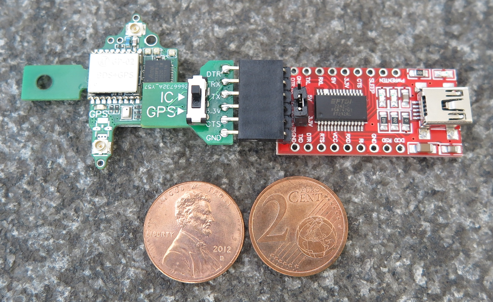
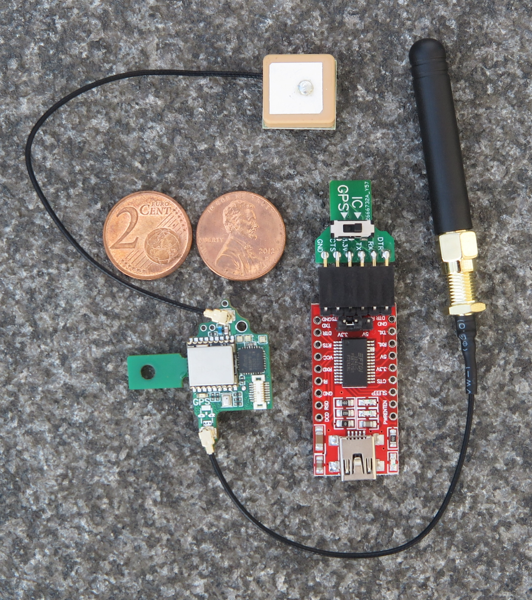
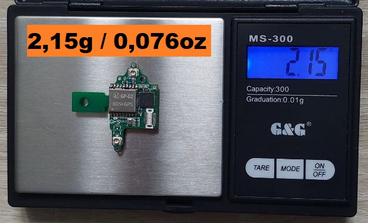
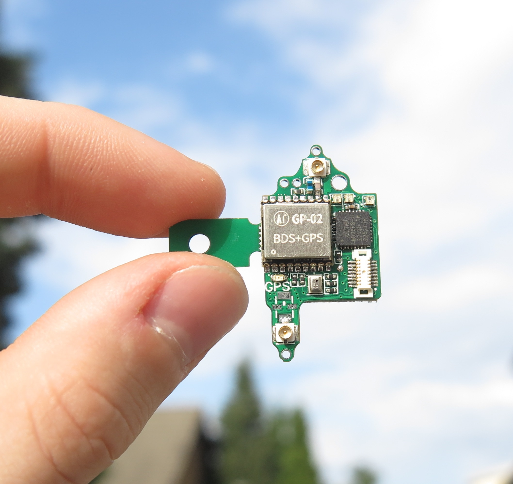

# Der kleinste Lora-APRS tracker, der aktuell verfügbar ist
 

Femto-APRS ist das kleinste und leichteste Lora-APRS Board auf dem Markt.
Ein 2m-APRS Sender in der selben Größe ist geplant, allerdings ist die Verfügbarkeit von 70 cm LoRa-APRS in Deutschland um einiges besser.
Geräte um Lora APRS zu empfangen sind außerdem weiter verbreitet und viel günstiger.

### Diese Seite befindet sich im Aufbau, alle wichtigen Infos (Software... Schaltplan...) werden noch in nächster Zeit ergänzt!

## Was kann das Board?

Das Board sendet in einem vorher programmierten Intervall APRS Nachrichten aus.
Diese bestehen aus dem Rufzeichen, Koordinaten, Höhe, Temperatur, Luftdruck und einer eigenen eingestellten Nachricht.
Die Aussendungen werden entweder von der eigenen Empfangsstation oder von öffentlichen Empfangsstationen empfangen und in das APRS-IS System eingespeist. 
Dann kann man den Sender auf [aprs.fi](https://aprs.fi/) tracken.

## Haupteinsatzzweck

Die Platine wurde für Stratosphärenflüge an Ballonen konzipiert.
Das Gewicht wurde so stark reduziert, sodass ein einfacher Folienballon aus dem Partybedarf ausreicht, um die Kapsel zu starten.
In diesem Fall wird die Stromversorgung über 6 x 0,5 Volt Solarzellen sichergestellt. Diese erzeugen eine Spannung von 3 Volt, bzw. bei direkter Sonneneinstrahlung bis zu 3,5 Volt.
Alternativ kann der Tracker selbstverständlich in Fahrrädern oder anderen Gerätschaften versteckt/verbaut werden. 
So ist zum Beispiel eine APRS-Flaschenpost auch geplant und eigene kreative Einsatzzwecke sind auch gerne gesehen.

    

# Wo gibt es das die Boards zu Kaufen?

### Wenn ihr einen Femto-APRS haben wollt, schreibt mir bitte eine kurze Mail an DO1MA@WEB.DE

Vergleichbare Boards (auf dem Markt) wären:

- Tracksoar       ca. 250€
- LightAPRS       ca. 130€
- Picoaprs        ca. 139€

Diese Boards gibt es aber teilweise nicht mehr zu kaufen, und sie sind zu teuer und zu schwer (für Stratosphärenflüge). 

#### Ich konzipiere mein Board so, dass es für unter 100€ angeboten werden soll.
(Board und Programmieadapter)

In einem Onlineshop gibt es die Sender noch nicht zu kaufen. Die aktuelle Version läuft sehr stabil und ist sehr ausgereift.
Ich gehe davon aus, dass die Entwicklung 2023 abgeschlossen wird und Anfang 2024 eine erste release Version steht. 
Dann wäre ein Vertrieb der Sender denkbar. Jedoch prüfe ich aktuell, ob überhaupt ein Interesse an den Boards besteht.

Du hast einen Online-Shop und würdest die Sender gerne anbieten? 
Melde dich gerne bei mir!

Wenn ihr an der Entwicklung teilhaben wollt, sei es Software oder Hardware, würde ich mich auch über eine Nachricht von Euch freuen.

    

Basis-Version mit Programmieradapter und Extended-Version mit GPS und Lora Antenne.                                                                                                                            

(Für Flüge werden dünne Drähte als externe Antennen angelötet!)

## Was ist alles auf der Platine verbaut?

- Arduino (ATMEGA328PB)
- GPS
- RFM98W Sendemodul 
- 4 Neopixel RGB LEDs
- Vorbereiteter Spannungsteiler für einen PTC/NTC
- Spannungsteiler zur Spannungsmessung
- diverse Kleinigkeiten

## Technische Informationen
Programmiert wird das Board über den Stecker auf der Vorderseite, auf den ein Adapter für ein USB FTDI Board gesteckt wird. Es ist ein reines 3,3 Volt Board!
Die Stromaufnahme beträgt weniger als 50mA, bei einer 10mW Aussendung unter 100mA.
Die maximale Sendeleistung beträgt 100 mW. Für Ballonflüge reichen 10mW im Regelfall aus. 
Mit 10mW habe ich aus dem 9. Stockwerk (Hochhaus) mehrere I-gates in über 100Km Entfernung erreicht.
Ich weiß nicht was die Community mit den Boards vorhat, aber das sollte reichen :-)

## Wie wird das Board programmiert?
# ACHTUNG
##### Die Software befindet sich bereits auf dem Board, beim Aufspielen einer neuen Software geht die alte Software dauerhaft verloren.

Konfiguriert wird das Board über die Arduino IDE. Auch für Anfänger ist die Einrichtung sehr simpel.

1. [Arduino IDE](https://www.arduino.cc/en/software) installieren
2. Port wählen (bei eingestecktem Board)
3. Seriellen Monitor öffnen

*Ein Board muss nicht gewählt werden, da wir nur die serielle Schnittstelle nutzen und das Board nicht programmieren.
Sollte die Software nach einem Board verlangen, kann der Arduino Uno oder Nano gewählt werden.
Dies macht für die Konfiguration keinen Unterschied.
Wer eine eigene Software schreiben will, muss über [MiniCore](https://github.com/MCUdude/MiniCore#how-to-install) den ATMega328PB zum Programmieren auswählen.

 
