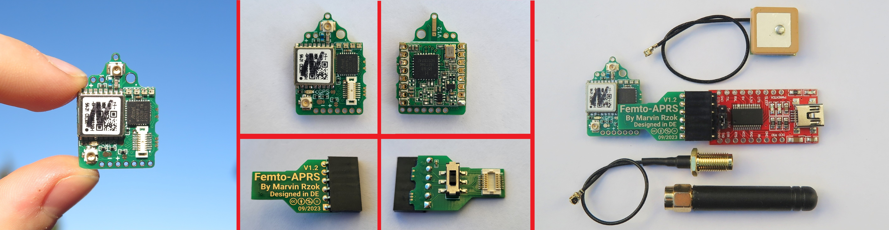
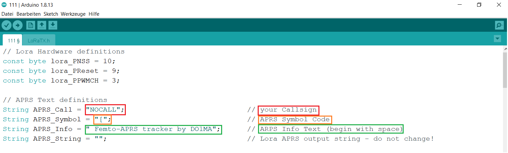

# Smallest Lora-APRS tracker available in the world
 

Femto-APRS ist das kleinste und leichteste Lora-APRS Board auf dem Markt.
Ein 2m-APRS Sender in der selben Größe ist geplant, allerdings ist die Verfügbarkeit von 70 cm LoRa-APRS in Deutschland um einiges besser.
Geräte um Lora APRS zu empfangen sind außerdem weiter verbreitet und viel günstiger.

## Diese Seite befindet sich im Aufbau, alle wichtigen Infos (Software... Schaltplan...) werden bis Ende September ergänzt!

## Was kann das Board?

Das Board sendet in einem vorher programmierten Intervall APRS Nachrichten aus.
Diese bestehen aus dem Rufzeichen, Koordinaten, Höhe, Temperatur, Luftdruck und einer eigenen eingestellten Nachricht.
Die Aussendungen werden entweder von der eigenen Empfangsstation oder von öffentlichen Empfangsstationen empfangen und auf [aprs.fi](https://aprs.fi/) hochgeladen.
Das eigene Gerät ist dann auf dieser Website zum verfolgen sichtbar.

## Haupteinsatzzweck

Die Platine wurde für Stratosphärenflüge an Ballonen konzipiert.
Das Gewicht wurde so stark reduziert,dass ein einfacher Folienballon aus dem Partybereich ausreicht um die Kapsel zu starten.
In diesem Fall wird die Stromversorgung über 6 x 0,5 Volt Solarzellen sichergestellt. Dies ergibt eine Spannung von 3 Volt, bei direkter Sonneneinstrahlung bis zu 3,5 Volt.
Alternativ kann der Tracker selbstverständlich in Fahrrädern oder anderen Gerätschaften versteckt werden. Eine APRS-flaschenpost ist auch geplant.
Eigene kreative Einsatzzwecke sind gerne gesehen

    

# Wo gibt es das die Boards zu Kaufen?

### Wenn ihr einen Femto-APRS haben wollt, schreibt mir bitte eine kurze Mail an DO1MA@WEB.DE
Ich habe ein paar Boards zum experimentieren zusammengelötet.

Vergleichbare Boards wären:

- Tracksoar       ca. 250€
- LightAPRS       ca. 130€
- Picoaprs        ca. 139€

Diese Boards gibt es aber teilweise nicht mehr zu kaufen, und sie sind zu teuer und schwer. 

#### Ich konzipiere mein Board so, dass es für unter 100€ angeboten werden soll.
(Board und programmieadapter)

In einem Onlineshop gibt es die Sender noch nicht zu kaufen. Die aktuelle Version läuft sehr stabil und ist sehr ausgereift.
Ich gehe davon aus, dass die Entwicklung 2023 abgeschlossen wird und Anfang 2024 eine finale Version steht. 
Dann wäre ein Vertrieb der Sender denkbar, ich habe allerdings keine ahnung, ob überhaupt ein Interesse an den Boards besteht.

Du hast einen Online-Shop und würdest die Sender gerne anbieten? 
Melde dich gerne bei mir!

Wenn ihr an der Entwicklung teilhaben wollt, sei es Software oder Hardware, würde ich mich auch über eine Nachricht von Euch freuen.
   

Basis-Version mit Programmieradapter und Extended-Version mit GPS Antenne und Lora Antenne.                                                                                                                                    (Für Flüge werden dünne Drähte als Antennen angelötet!)

## Was ist alles auf der Platine verbaut?

- Arduino (ATMEGA328PB)
- GPS
- RFM98W Sendemodul 
- Neopixel RGB LEDs
- BMP280/BME280 Temperatur/Luftdruck Sensor
- Spannungsteilerzur spannungsmessung (in der Testphase)
- diverse Kleinigkeiten

## Technische Informationen
Programmiert wird das Board über den Stecker auf der Vorderseite, auf den ein Adapter für ein USB FTDI Board gesteckt wird. Es ist ein reines 3,3 Volt Board!
Die Stromaufnahme beträgt weniger als 50mA, bei einer 10mW Aussendung unter 100mA.
Die maximale Sendeleistung beträgt 100 mW, für Ballonflüge reichen 10mW im Regelfall aus. 
Mit 10mW habe ich aus dem 9. Stockwerk (Hochhaus) mehrere I-gates in über 100Km Entfernung erreicht.
Ich weiß nicht was die Community mit den Boards vorhat, aber das sollte reichen :-)

## Wie wird das Bort programmiert?

Programmiert wird das Board über die Arduino IDE. Wenn ihr schon einmal einen Arduino programmiert habt oder euch damit auseinandergesetzt habt,
sollte das ganze kein Problem darstellen. Auch für Anfänger ist die Einrichtung sehr simpel.

1. Arduino IDE installieren 
2. Minicore Boards Extension installieren
3. ATMEGA328PB (8MHz inernal) (2,7V BOD) auswählen.
4. Arduino Code öffnen und in den ersten Zeilen des Programmcodes eigenes Rufzeichen und eigene Statusnachricht eintragen.
5. Code hochladen und testen.

 
 
